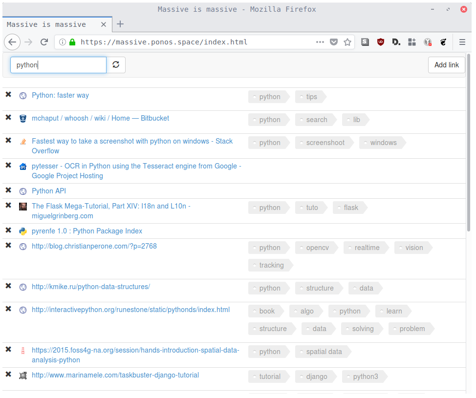

massive-octo-tribble
====================

import,store and search bookmarks. Based on Flask. Yes the css is not pretty, ongoing work.




* Default to SQLite through PonyOrm
* Flask
* bcrypt for passwords encryption

Dependencies
------------

Ubuntu:

```bash
sudo apt-get install python-dev build-essential libjpeg-dev libfreetype6 libfreetype6-dev zlib1g-dev libffi-dev python3-dev
```

Installation
------------

```bash
git clone https://github.com/tristan-c/massive-octo-tribble && cd massive-octo-tribble
pyvenv venv
source venv/bin/activate
pip install -r requirement.txt
python run.py
```

Add a user:
```bash
python addUser.py
```

Or use the in app register.

add a salt in config file

```python
SECRET_KEY = "key well generated"
SECURITY_PASSWORD_SALT = "key well generated"
```

Everything is setup, You can open your browser at http://localhost:7777/.


Importing bookmarks from firefox/chrome:
---------------------------------------

```bash
python import_bookmarks.py /path/to/my/file MyUserName
```
